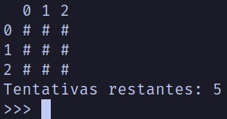

# Compilação:
**Descrição:**
+ Jogo compilado para GNU / LINUX

# Sobre o jogo:
**Jogo:**
Você precisa caçar o tesouro, informando as coordenadas, que seria a linha e a coluna.

 

**Jogo feito para terminal:**
O jogo foi feito para terminal, mas quando eu adquirir conhecimento, irei colocar o jogo em interface gráfica.

**Bugs:**
Fique a vontade para arrumar ou usar o código do jogo, atualmente ele tem vários bugs, mas conforme eu ganhe expêriencia eu arrumo(s).

